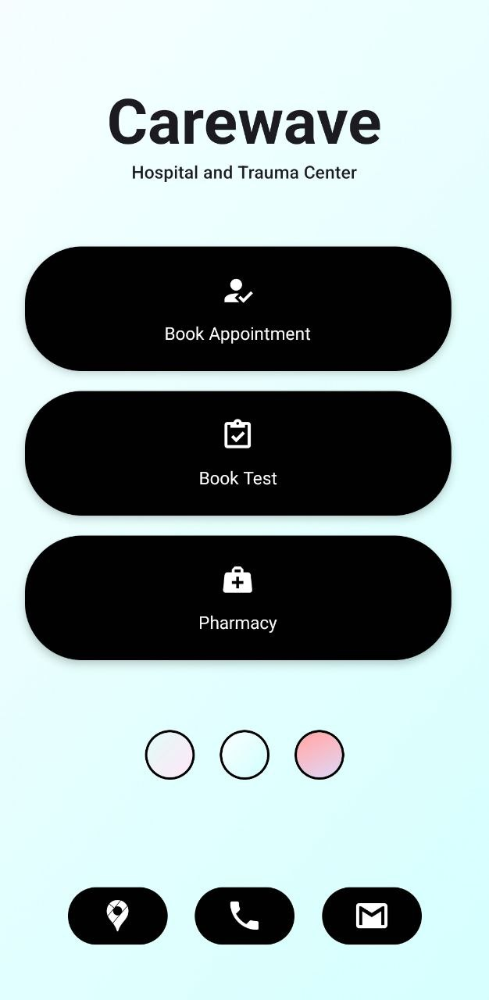
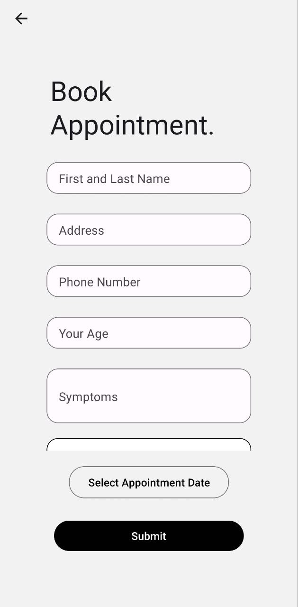
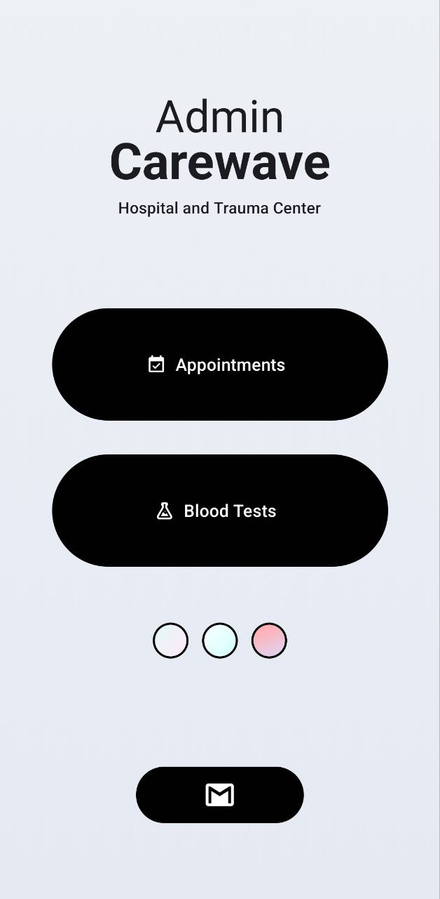
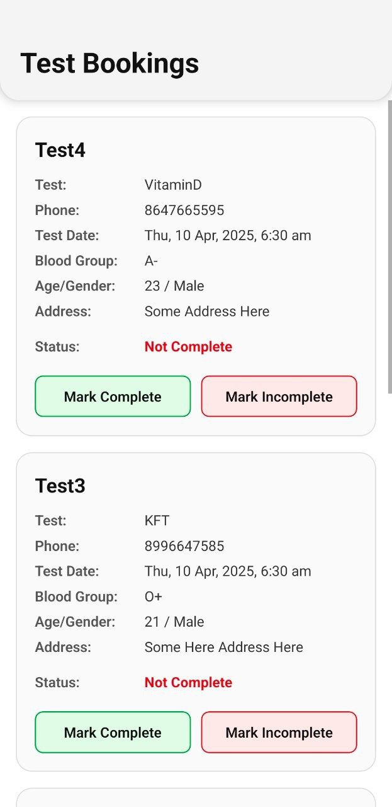

# 🏥 Carewave

**Carewave** is a modern, cross-platform healthcare application designed for a rural hospital to manage its two core services:  
📅 Appointment Booking & 🧪 Blood Test Scheduling.

Built with **React Native** and powered by **Firebase**, Carewave makes it easy for patients to book and for hospital staff to manage everything in one place — whether on the web or a mobile device.

---

## 📁 Project Structure

This application is split into two major parts for streamlined user and admin experiences:

### ✅ Carewave-Client
- 📱 Available on Web, Android, and iOS
- ✍️ Allows patients to:
  - Book appointments
  - Book blood tests
  - Receive confirmation and store history

### 🛠️ Carewave-Admin
- 🖥 Used by hospital staff for:
  - Viewing all patient bookings
  - Updating test/appointment statuses (Complete / Not Complete)
  - Managing contact and support options

---

## ⚙️ Tech Stack

- ⚛ **React Native** (via Expo)
- 🔥 **Firebase**
  - Realtime Database
  - Firebase Auth (for login/signup)
- 📱 **Cross-platform compatibility** (Web, Android, iOS)

---

## ✨ Features

### Carewave Client
- Clean and responsive UI
- Real-time appointment/test submission
- Background gradient selection
- Direct call, email, and map integration

### Carewave Admin
- View all incoming bookings with patient details
- Mark tests/appointments as *Complete* or *Not Complete*
- Organized cards with user-friendly interaction
- Firebase-backed real-time updates

---

## 🖼️ Screenshots

<p align="center">
  
  
  
  
</p>

---

## 🚀 Getting Started

### 1️⃣ Clone the Repository

```bash
git clone https://github.com/your-username/Carewave.git
cd Carewave
```

### 2️⃣ Install Dependencies

Navigate to each sub-project and install dependencies:

```bash
cd Carewave-client
npm install

cd ../Carewave-admin
npm install
```

### 3️⃣ Run Locally (Expo)

#### Client App
```bash
cd Carewave-client
npx expo start
```

#### Admin App
```bash
cd Carewave-admin
npx expo start
```

---

## 🔐 Firebase Setup

Create a `.env` file in both `Carewave-client` and `Carewave-admin` folders and add your Firebase credentials:

```env
API_KEY=your_api_key
AUTH_DOMAIN=your_project.firebaseapp.com
DATABASE_URL=https://your_project.firebaseio.com
PROJECT_ID=your_project_id
STORAGE_BUCKET=your_project.appspot.com
MESSAGING_SENDER_ID=your_sender_id
APP_ID=your_app_id
```

> 💡 Make sure to enable **Realtime Database** and **Authentication (Email/Password)** in your Firebase project.

---

## 💡 Usage

### For Patients (Client App)
1. Open the app and choose between "Book Appointment" or "Book Test".
2. Fill in required information such as name, age, gender, phone, symptoms/test type, etc.
3. Select a date and submit the request.
4. The hospital will receive your request and update your status.
5. You can contact the hospital via integrated buttons for 📞 call, 📍 maps, or 📧 email.

### For Hospital Staff (Admin App)
1. Log into the admin panel.
2. View all upcoming appointments and blood test bookings.
3. See patient details like name, age, symptoms, date/time, and test type.
4. Use “Mark Complete” or “Mark Incomplete” to update the status of services in real-time.
5. The database updates automatically, reflecting the current status.

---

## 📜 License

This project is open source and available under the [MIT License](LICENSE).

---

## 📣 Contributing

Have ideas or want to contribute? PRs are welcome! Please open an issue first to discuss your changes.
